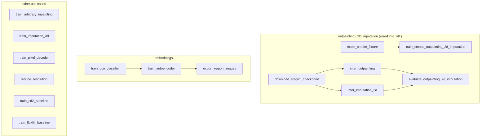

# MORPHE

A reproducible workflow port of [HickeyLab/MORPHE](https://github.com/HickeyLab/MORPHE),
the code for *MORPHE: Bridging Image Generation and Spatial Omics for Tissue
Synthesis* (Feng, Robers, Rasheed, Miao, Wen, Lee, Sohigian, Brbić, Hickey;
[preprint](https://www.biorxiv.org/content/10.64898/2026.03.03.709377v1)).
Credit for the method and the original implementation belongs to the Hickey
Lab. This fork replaces the notebook collection with a Snakemake workflow,
a pinned pixi environment, tests and a documented list of upstream defects
and fixes.

MORPHE learns a graph-informed embedding that maps discrete cell identities
and their spatial relationships into an RGB-like latent space, then trains
diffusion models on that embedding to outpaint beyond a tissue sample's field
of view, inpaint damaged regions, and impute across 2D and 3D gaps.

## Repository layout

- `src/morphe/`: the library (datasets, models, training loops, inference
  engines, embeddings (GCN classifier + autoencoder), evaluation metrics,
  finetune baselines and preprocessing).
- `workflow/Snakefile` and `workflow/rules/*.smk`: one rule per pipeline step.
- `config/config.yaml` and `config/smoke.yaml`: every path, seed, pretrained
  model id and hyperparameter.
- `tests/`: unit tests plus a Snakemake dry-run check on both configs.
- `Assets/`: the six real sample region images used for the flagship
  reproduction below, and the README's figures.

## Quick start

```bash
pixi run smoke   # synthetic fixture, CPU, seconds
pixi run test    # unit tests + snakemake -n on both configs
pixi run all     # published checkpoint + real region images, GPU
pixi run lint    # ruff + pyrefly
```

`data/` and `results/` are gitignored; point them (via symlink, as this
fork's own working copy does) at wherever your data and outputs actually
live.

## Workflow DAG

The DAG below shows the rules wired into `rule all` (the outpainting/2D-
imputation reproduction) plus the other pipelines, defined but run
independently since their inputs exceed what this repository downloads
(see "Pipeline data requirements" below).



## Pipeline data requirements

| Pipeline | Wired into `all`? | Data it needs | Status here |
|---|---|---|---|
| Outpainting / 2D imputation | yes | six sample region images (`Assets/sample_regions`, shipped) + published checkpoint | run end to end on real data and the published weights |
| Evaluation metrics | yes | the above outputs | four of five metrics run structurally only; see below |
| Embeddings (GCN + autoencoder) | no | the full 2.6M-cell CODEX table | DAG defined; the table is far larger than this fork downloads |
| Arbitrary inpainting | no | a training region set (own excluded-region split) | DAG defined; no published checkpoint for this use case |
| 3D imputation | no | a MERFISH whole-brain z-stack | DAG defined; not downloaded here |
| Pixel-diffusion decoder | no | a precomputed (latent, image) index | DAG defined; needs a training run to produce first |
| Preprocessing (resolution reduction) | no | the exact pre-merged CSV the notebook used | not published; see below |
| SD2 / FluxFill finetune baselines | no | a training image set | DAG defined; baselines for comparison, not MORPHE itself |

## Datasets

- CODEX intestine (outpainting / 2D imputation / arbitrary inpainting):
  [Dryad doi:10.5061/dryad.pk0p2ngrf](https://datadryad.org/dataset/doi:10.5061/dryad.pk0p2ngrf)
  (2.9 GB, per-cell tables, not the rasterised region images).
- MERFISH whole mouse brain atlas (3D imputation):
  [CZ CELLxGENE collection](https://cellxgene.cziscience.com/collections/0cca8620-8dee-45d0-aef5-23f032a5cf09).
- MERFISH mouse cortex (additional inpainting test):
  [doi:10.35077/g.21](https://doi.org/10.35077/g.21).

## Published weights

| Task | HuggingFace repository |
|---|---|
| Outpainting / 2D imputation | [Hickey-Lab/MORPHE_CODEX_Outpainting](https://huggingface.co/Hickey-Lab/MORPHE_CODEX_Outpainting) |
| Arbitrary inpainting | [Hickey-Lab/MORPHE_CODEX_Arbitrary_Inpainting](https://huggingface.co/Hickey-Lab/MORPHE_CODEX_Arbitrary_Inpainting) |
| 3D imputation | [Hickey-Lab/MORPHE_Mousebrain_3DImputation](https://huggingface.co/Hickey-Lab/MORPHE_Mousebrain_3DImputation) |
| Pixel-diffusion decoder | [Hickey-Lab/MORPHE_CODEX_PixelDiffusion](https://huggingface.co/Hickey-Lab/MORPHE_CODEX_PixelDiffusion) |

Only the outpainting/2D-imputation repository is downloaded here (three of
its files: the UNet, CoordEncoder and CondEncoder; the rest is optimiser/RNG
state). `download_stage1_checkpoint` verifies each against the SHA-256
committed in `config/config.yaml`.

## Real-data reproduction

`pixi run all` downloads the published outpainting checkpoint (about 3.7 GB)
and runs both outpainting and 2D imputation on the six real sample region
images, then scores the outputs. Fidelity notes:

- Neither `Inference_Outpainting.ipynb` nor `Inference_2D-Imputation.ipynb`
  stored any numeric output, and `Evaluation.ipynb` stored none either (its
  cells were never executed; see "Evaluation.ipynb never ran" below) and the
  README lists metric *names* only, no values. There is nothing upstream to
  numerically match against; `parity.md` (in the notes directory, not this
  repository) records what the ported pipeline itself produces.
- Of the five evaluation metrics, only spatial structure (LPIPS, directly on
  RGB) is a meaningful score here: the other four decode RGB into cell types
  through an autoencoder checkpoint the upstream notebook never published
  (`newae2.pth`). They are run against a freshly initialised, untrained
  autoencoder purely to confirm the ported code executes end to end on real
  images; their output is explicitly flagged as not meaningful.

## Differences from upstream

Five confirmed bugs, each its own commit with a regression test:

1. **Mask axis transposition.** `stage1_dataset.py`'s
   `mask[:, x1:x2, y1:y2]` on a `[C, H, W]` tensor, and `mask_utils.py`'s
   `create_latent_mask` (`torch.meshgrid` at its default `'ij'` indexing),
   both put the bbox's x-extent on the row axis. The published checkpoints
   were trained under this transposed convention, so
   `config.mask_axis_convention` defaults to `"upstream"` (reproduces it,
   required for the published weights) with `"xy"` available for training a
   fresh checkpoint. See `morphe.masks`.
2. **Nonexistent validation directory.** `Latent_Diffusion_Trainer.py:22`
   opened a hardcoded `val_data` directory that does not exist in the
   repository. Train/val are now an explicit, region-exclusion split recorded
   in config (`outpainting_2d_imputation.split`; see
   `morphe.datasets.stage1_dataset.split_by_region`). The same data-leakage
   pattern (`Train_Arbitrary_Inpainting.ipynb`'s `OutpaintTrainer_new` built
   train and val from the *same* directory) is fixed the same way for
   arbitrary inpainting.
3. **Unfiltered directory listing.** `Stage1Dataset` listed every file under
   `train_data/`, including two stray text files (`1`, `111`, since deleted).
   `list_image_files` now filters by image extension.
4. **Removed pretrained id.** `runwayml/stable-diffusion-v1-5` was removed
   from HuggingFace. `stable-diffusion-v1-5/stable-diffusion-v1-5`, pinned by
   commit hash, replaces it everywhere the original loaded that id
   (outpainting/2D imputation, 3D imputation, arbitrary inpainting, the
   pixel-decoder's scheduler and VAE-encoder).
5. **Hardcoded Colab and placeholder paths.** `drive/MyDrive/...`,
   `"Image_Path"`, `"1.png"`, `"your_path"` and similar placeholders are gone;
   every path is a config value or constructor argument.

Additional defects found while porting (not in the confirmed list, each
noted at its port site):

- **`Evaluation.ipynb` never ran.** It calls six helper functions
  (`kl_to_similarity`, `compute_hist`, `compute_ratio`,
  `compare_cluster_feature_centroids`, `catplot2`,
  `save_inferred_map_to_df`) that are referenced but never defined anywhere
  in the repository, consistent with its stored outputs being empty. The
  five metric functions are ported verbatim; the six helpers are
  reconstructed in `morphe.evaluation.metrics` from their call sites.
- **Three inconsistent `infer_cell_map` implementations.** The notebooks
  used three different means of decoding an RGB embedding back to a
  cell-type map: `Embeddings/03_Interpret_Cellmap.ipynb`'s (which inverts the
  RGB back to the autoencoder's latent scale before decoding, and 1-indexes
  types), `Evaluation/Evaluation.ipynb`'s (skips the inverse scaling,
  0-indexes) and `Pixel_Diffusion_Decoder/utils/composition.py`'s (calls the
  full autoencoder forward pass rather than the decoder alone). The port
  standardises on the first, since it is the only one dimensionally
  consistent with how the RGB image is built
  (`morphe.embeddings.autoencoder.embed_to_rgb`).
- **`precompute_latents` called an undefined dataset argument.**
  `Dataset_Construct_for_Decoder.ipynb` called
  `OutpaintDataset(..., no_mask=True)`; no dataset in the repository accepts
  `no_mask`. `morphe.inference.pixel_decoder.precompute_latents` takes an
  already-constructed dataset instead.
- **Division by a possibly-zero range.** `embed_to_rgb`'s min-max scaling
  divides by `max - min` per channel; the line that sets a zero range to a
  small epsilon before dividing was commented out upstream. Restored.
- **`CoordEncoder`'s checkpoint layout does not match its own training
  module.** `Train/models/coord_encoder.py` defines `CoordEncoder` as a class
  wrapping its layers in `self.net`, but the published checkpoint
  (`model_2.safetensors` in `Hickey-Lab/MORPHE_CODEX_Outpainting`) has flat
  keys (`0.weight`, `0.bias`), matching the inference notebooks' inline
  `nn.Sequential(nn.Linear(4, 32), nn.GELU())` instead: the run that produced
  the published weights evidently used that form. `morphe.models.coord_encoder.CoordEncoder`
  now subclasses `nn.Sequential` directly to match the real checkpoint; this
  was found by, and fixed during, the real-data run below.

Intentional deviations, not bug fixes:

- Outpainting inference decodes with `stabilityai/sd-vae-ft-ema`, distinct
  from the SD1.5-bundled VAE used at training time and by 2D-imputation
  inference; this is an observed upstream train/inference inconsistency,
  kept rather than silently corrected.
- `Stage1Dataset`'s bbox tensor is `float32`, not the upstream `float16`
  (pixel-precision only; masks round to whole pixels either way).
- `torch_geometric.data.Dataset` subclasses now implement `len()`/`get()`
  (the library's own interface) rather than overriding `__len__`/
  `__getitem__` directly.
- The evaluation metrics' interactive-only plotting branches (3D RGB
  centroid scatter, cluster maps, log2-fold-change heatmaps) are dropped;
  every metric's numeric logic is unchanged.

## Configuration reference

See `config/config.yaml` for the full schema (every section is commented at
its use site) and `config/smoke.yaml` for the tiny/synthetic variant. Notable
keys: `pretrained` (the SD1.5 mirror and pin), `mask_axis_convention`,
`outpainting_2d_imputation.split` (the excluded region set),
`outpainting_2d_imputation.published_checkpoint` (repo + per-file SHA-256),
`evaluation.z_min`/`z_max` (the trained autoencoder's recorded latent range).

## Licence

Upstream publishes no licence. This fork adds none either; the code is not
ours to relicense.
